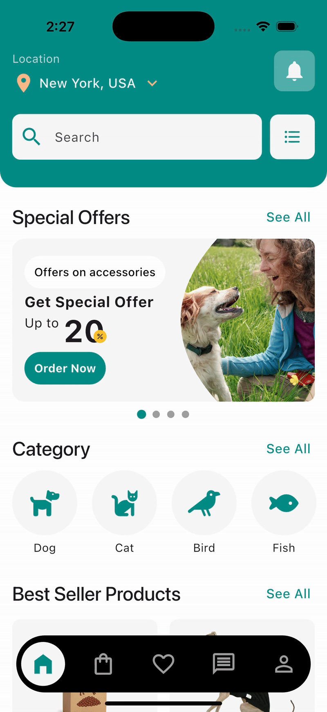

# Flutter Pets App

A pet-themed Flutter application focused on **UI/UX**. Showcasing a clean layout, animations for the bottom navigation bar and clean architecture.

> ⚠️ This is a frontend-only mockup. It does not include backend functionality — all data is static and meant for design demonstration purposes.

## Features

1. Custom theme and colors
2. Modular widget structure
3. Smooth animations
4. Built using Flutter and Dart  

## Screenshots

<p>
  
  
  
</p>

## Tech Stack

### 🛠️ Core Technologies

- **[Flutter](https://flutter.dev/)** – UI toolkit for building natively compiled applications across mobile, web, and desktop from a single codebase.
- **[Dart](https://dart.dev/)** – Programming language optimized for building fast, multi-platform apps.

### 📦 Dependencies

- **[`flutter_riverpod`](https://pub.dev/packages/flutter_riverpod)** – State management solution that helps structure and scale Flutter apps with reactive programming.
- **[`font_awesome_flutter`](https://pub.dev/packages/font_awesome_flutter)** – Provides popular [Font Awesome](https://fontawesome.com/) icons as Flutter widgets for easy use in UI design.
- **[`smooth_page_indicator`](https://pub.dev/packages/smooth_page_indicator)** – Customizable animated page indicators compatible with `PageView` in Flutter, useful for onboarding and carousels.

## Getting Started

Follow these steps to run the project locally:

### 1. Clone the repository

```bash
git clone https://github.com/EmilianoAngelJ/flutter-pets-app.git
cd flutter-pets-app
```

### 2. Install dependencies

```bash
flutter pub get
```

### 3. Run the app

```bash
flutter run
```

## Notes

- This project is for educational and portfolio purposes.

## Credits 

This app's design was inspired by a mockup found on Instagram. Full credit to the original designers.
- **[`Original post`](https://www.instagram.com/p/DA510d7AZId/?igsh=ZHVxYjBpdjU3aDk3)** 

Design by:

- **[`@insightlancer`](https://www.instagram.com/insightlancer?igsh=OXA2a3lyeHgyaTV5)** 
- **[`@kg_graphics_design`](https://www.instagram.com/kg_graphics_design?igsh=MW9waGY0NmhueW1ueg==)** 

Many placeholder images were sourced from [`Unsplash`](https://unsplash.com), a free and open-source image placeholder service.

Images: 

- Photo by [M Burke](https://unsplash.com/es/@mollys_life?utm_content=creditCopyText&utm_medium=referral&utm_source=unsplash) on [Unsplash](https://unsplash.com/es/fotos/perro-pequeno-de-pelaje-largo-blanco-sobre-piso-de-madera-marron-l1UsjV2WrNM)

- Photo by [Ayla Verschueren](https://unsplash.com/es/@moob?utm_content=creditCopyText&utm_medium=referral&utm_source=unsplash) on [Unsplash](https://unsplash.com/es/fotos/un-perro-marron-y-blanco-sentado-junto-a-un-tazon-de-comida-jnq52JjkLAg)

- Photo by [James Lacy](https://unsplash.com/es/@jlacy7?utm_content=creditCopyText&utm_medium=referral&utm_source=unsplash) on [Unsplash](https://unsplash.com/es/fotos/perro-de-pelaje-corto-marron-y-blanco-mordiendo-palo-de-madera-marron-5w3oIN-0Lzs)

- Photo by [Kariso ou](https://unsplash.com/es/@karisou?utm_content=creditCopyText&utm_medium=referral&utm_source=unsplash) on [Unsplash](https://unsplash.com/es/fotos/un-perro-pequeno-con-una-camisa-negra-sobre-un-fondo-blanco-mpXYZkv9rLQ)

- Photo by [FLOUFFY](https://unsplash.com/@theflouffy?utm_content=creditCopyText&utm_medium=referral&utm_source=unsplash) on [Unsplash](https://unsplash.com/photos/fawn-pug-wearing-blue-and-white-scarf-PJTfOzSo8fQ)

- Photo by [Clay Elliot](https://unsplash.com/es/@ibidsy?utm_content=creditCopyText&utm_medium=referral&utm_source=unsplash) on [Unsplash](https://unsplash.com/es/fotos/un-perro-con-chaleco-3rZ680odMeM)

       


## License

This project is licensed under the [MIT License](LICENSE).

---

Built using Flutter by [Emiliano Angel](https://github.com/EmilianoAngelJ)
